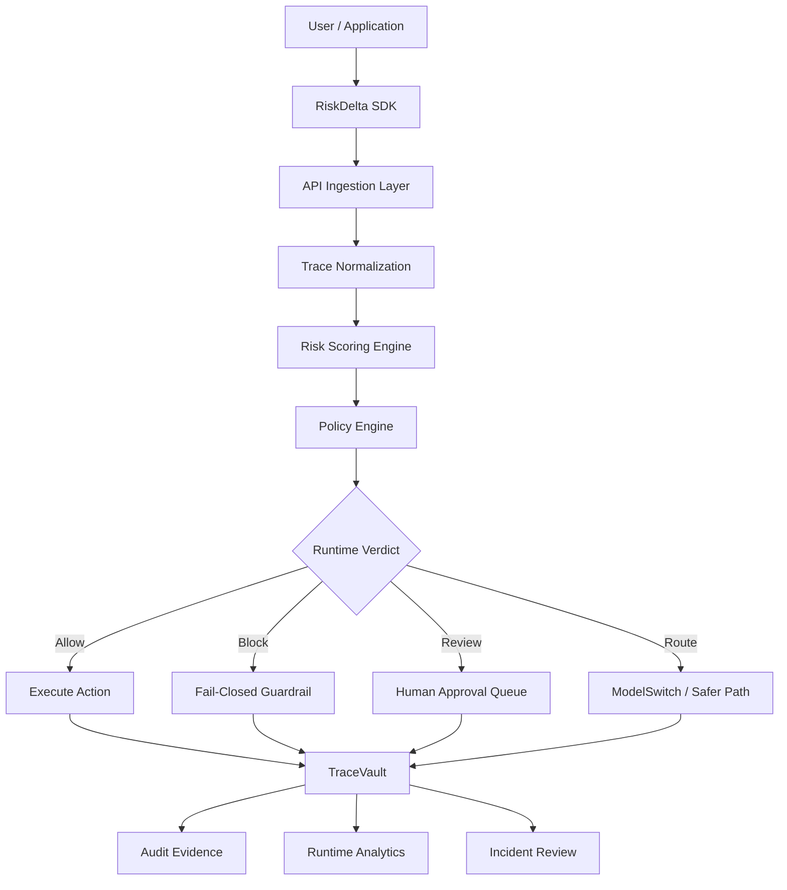

<h1 align="center">⚡ RiskDelta AI</h1>

<p align="center">
  <strong>Autonomous Risk Intelligence Control Plane for AI Systems, Agents & Copilots</strong>
</p>

<p align="center">
  <em>Policy enforcement, risk scoring, runtime guardrails, human approvals, and audit trails for production AI.</em>
</p>

<p align="center">
  
  
  
  
</p>

<p align="center">
  
  
  
  
  
  
</p>

<p align="center">
  <a href="#-quick-start">Quick Start</a>
  ·
  <a href="#-architecture">Architecture</a>
  ·
  <a href="#-runtime-flow">Runtime Flow</a>
  ·
  <a href="#-sdk-preview">SDK Preview</a>
  ·
  <a href="#-license">License</a>
</p>

---

## ⚡ What is RiskDelta?

**RiskDelta** is a multi-tenant AI runtime control plane designed for production LLM systems, AI agents, copilots, and enterprise AI applications.

As AI products move from **answering questions** to **taking actions**, the risk layer changes.

It is no longer enough to only moderate prompts.

Production AI needs a runtime layer that can:

- score risky model behavior
- enforce deterministic policies
- block unsafe tool calls
- require human approval for sensitive actions
- preserve evidence for audits
- create traceability across users, models, agents, and tools

RiskDelta sits between:

```txt
Users → Models → Agents → Tools → Enterprise Systems
```

…and acts as the control plane for runtime AI risk.

> **RiskDelta is built for the execution layer of AI.**

---

## 🚨 Why RiskDelta Exists

Most AI safety tools focus on content-level checks:

```txt
Is this prompt safe?
Is this response harmful?
Is this text policy-compliant?
```

That is useful, but incomplete.

The bigger risk appears when AI systems can do things:

```txt
Send emails
Call APIs
Read customer data
Trigger workflows
Modify databases
Access internal tools
Execute agentic actions
```

At that point, the real question becomes:

```txt
Should this AI action be allowed right now, for this user, in this context?
```

RiskDelta is designed to answer that question.

---

## ✅ What RiskDelta Provides

| Layer | Capability |
|------|------------|
| Runtime Control | Intercepts AI events, traces, and tool actions |
| Risk Scoring | Scores model responses and agent actions |
| Policy Engine | Applies deterministic rules before execution |
| Guardrails | Blocks, allows, escalates, or routes actions |
| Human Approval | Requires review for sensitive operations |
| TraceVault | Stores full audit evidence for every decision |
| SDK/API | Allows integration into AI apps and agents |

---

## 🧠 Core Product Thesis

AI systems will not only fail because they hallucinate.

They will fail because they are allowed to act without control.

RiskDelta exists to control that layer.

```txt
Prompt filtering protects conversations.
RiskDelta protects execution.
```

---

## 🧩 Core Components

| Component | Role |
|----------|------|
| **Policy Engine** | Deterministic policy evaluation and decisioning |
| **Risk Scoring Engine** | Scores each AI response, trace, or action |
| **PromptShield** | Input validation and prompt-level inspection |
| **DataGuard** | Sensitive data and leakage protection |
| **ModelSwitch** | Model routing based on risk and context |
| **AgentFence** | Agent action boundary enforcement |
| **SentinelX** | Final runtime verdict engine |
| **TraceVault** | Audit, trace, and evidence preservation |
| **ActionLoop** | Feedback loop for runtime learning and review |

---

## ⚙️ Architecture



---

## 🔁 Runtime Flow

RiskDelta follows a deterministic runtime chain:

```txt
1. Ingest runtime event
2. Normalize trace and session context
3. Score risk
4. Evaluate policy
5. Produce runtime verdict
6. Enforce action
7. Preserve evidence in TraceVault
```

Example:

```txt
User asks an AI agent:
"Delete inactive users from the database."

RiskDelta evaluates:
- Who is the user?
- What is the action?
- What system is being touched?
- Is this reversible?
- Does policy allow this?
- Is approval required?
- What evidence should be stored?

Verdict:
BLOCKED / REQUIRES_APPROVAL
```

---

## 🛡️ Runtime Verdicts

RiskDelta can return multiple enforcement outcomes:

| Verdict | Meaning |
|--------|---------|
| `ALLOW` | Action is permitted |
| `BLOCK` | Action is denied |
| `REVIEW` | Human approval required |
| `REDACT` | Sensitive data should be removed |
| `ROUTE` | Route to safer model or workflow |
| `LOG_ONLY` | Permit action but preserve evidence |
| `ESCALATE` | Send to incident/review workflow |

---

## 🎯 Use Cases

RiskDelta is useful for teams building:

- AI copilots inside SaaS products
- autonomous agents with tool access
- enterprise LLM applications
- internal AI platforms
- AI workflow automation tools
- customer support copilots
- sales and ops agents
- security-sensitive AI applications
- compliance-heavy AI deployments

---

## ⚡ Example Runtime Decision

```txt
Input:
AI agent wants to update a production CRM record.

RiskDelta detects:
- External system access
- Customer data mutation
- Medium confidence response
- High business impact action

Risk Score:
0.87 / HIGH

Policy:
Sensitive customer data mutation requires approval.

Verdict:
REVIEW

Action:
Block execution until human approval.

Evidence:
Stored in TraceVault.
```

---

## 💻 SDK Preview

Example trace ingestion using the Node SDK:

```ts
import { RiskDelta } from "@riskdelta/sdk-node";

const riskdelta = new RiskDelta({
  apiKey: process.env.RISKDELTA_API_KEY,
});

const verdict = await riskdelta.evaluate({
  workspaceId: "workspace_123",
  userId: "user_456",
  sessionId: "session_789",
  event: {
    type: "agent.tool_call",
    tool: "delete_customer_record",
    input: {
      customerId: "cus_123",
      reason: "inactive account cleanup",
    },
  },
});

if (verdict.action === "BLOCK") {
  throw new Error("Action blocked by RiskDelta policy");
}

if (verdict.action === "REVIEW") {
  console.log("Human approval required");
}
```

---

## 🧪 CLI Preview

```bash
> riskdelta run

✔ Trace ingested
✔ Session normalized
✔ Risk score: 0.87 HIGH
✔ Policy matched: sensitive_action_requires_approval
✔ Verdict: REVIEW
✔ Action: Awaiting human approval
✔ Evidence stored in TraceVault
```

---

## 📦 Repository Structure

```txt
apps/
  web
    Next.js public site and RiskDelta Console baseline

  api
    Fastify API for ingestion, workspace setup, and runtime endpoints

  worker
    BullMQ worker for runtime processing pipeline

packages/
  config
    Shared environment validation

  types
    Shared contracts and edition markers

  shared
    Shared helpers and utilities

  sdk-node
    Node SDK for trace ingestion and runtime evaluation

  risk-engine
    Source-available baseline risk scoring logic

  policy-engine
    Source-available policy DSL and evaluator

  ui
    Shared UI primitives
```

---

## 🧱 What This Repo Contains

This public repository includes the source-available baseline for:

- public website
- console baseline
- API ingestion
- trace ingestion contracts
- policy evaluation baseline
- risk scoring baseline
- worker pipeline baseline
- SDK integration baseline
- shared UI and types
- local development setup

---

## 🔒 What Is Intentionally Not Included

This public repository does **not** ship the full commercial implementation for:

- managed policy authoring workflows
- advanced policy simulation
- managed runtime control inventory
- dedicated risk workstation views
- incident queueing and remediation workflows
- enterprise connectors
- managed integration verification
- commercial enforcement workflows

These boundaries are represented through explicit placeholders, stable interfaces, and edition-aware separation.

They are not hidden behind obfuscation.

---

## 🧩 Edition Boundaries

RiskDelta uses a source-available model.

| Area | Public Baseline | Commercial Edition |
|-----|-----------------|-------------------|
| Runtime ingestion | Included | Advanced managed ingestion |
| Risk scoring | Baseline | Advanced scoring workflows |
| Policy engine | Baseline DSL | Managed policy authoring/simulation |
| TraceVault | Baseline evidence model | Managed audit and incident surfaces |
| Console | Baseline console | Full enterprise workstation |
| Integrations | Safe placeholders | Managed connectors |
| Workflows | Local/dev baseline | Production enterprise workflows |

---

## 🚀 Quick Start

### Prerequisites

- Node.js 20+
- pnpm 10+
- Docker

### Local Setup

```bash
git clone https://github.com/your-username/riskdelta-ai
cd riskdelta-ai

cp .env.example .env

docker compose up -d

pnpm install
pnpm db:generate
pnpm db:push
pnpm db:seed

pnpm dev
```

---

## 🌐 Local Endpoints

| Service | URL |
|--------|-----|
| Web | http://localhost:3000 |
| API | http://localhost:4100/v1 |
| MinIO Console | http://localhost:9001 |

---

## 🧪 Development Commands

```bash
pnpm typecheck
pnpm lint
pnpm test
pnpm build
pnpm secrets:scan
pnpm security:public-env
```

---

## 🧾 Example Policy Concept

```ts
export const sensitiveActionPolicy = {
  id: "sensitive_action_requires_approval",
  description: "Require approval for destructive or sensitive tool actions.",
  when: {
    eventType: "agent.tool_call",
    riskLevel: ["HIGH", "CRITICAL"],
    toolCategory: ["database", "crm", "billing", "identity"],
  },
  then: {
    verdict: "REVIEW",
    reason: "Sensitive action requires human approval.",
  },
};
```

---

## 📊 Product Status

| Area | Status |
|-----|--------|
| Public site | Active |
| Console baseline | Active |
| API ingestion | Active |
| Worker pipeline | Active |
| Policy engine baseline | Active |
| Risk engine baseline | Active |
| SDK baseline | Active |
| Commercial workflows | Private |

---

## 🧠 Design Principles

RiskDelta is built around five principles:

```txt
1. Fail closed by default
2. Preserve evidence for every decision
3. Separate policy from application logic
4. Make AI actions observable
5. Treat runtime control as infrastructure
```

---

## 🧭 Why This Matters

Enterprise AI adoption is moving from chat interfaces to agentic systems.

That means AI applications are beginning to:

- access internal systems
- make decisions
- execute workflows
- modify records
- interact with customers
- trigger business-critical actions

Without runtime control, companies are forced to choose between:

```txt
Move fast with risk
or
Move slowly with manual review
```

RiskDelta gives teams a third path:

```txt
Move fast with control.
```

---

## 🧪 Local UI Screenshots

Captured from a live local run to verify UI rendering and route behavior.

> Add screenshots under `docs/screenshots/` and update paths below.

```txt
docs/screenshots/marketing-integrations.png
docs/screenshots/app-overview.png
docs/screenshots/app-quickstart-runtime-usage.png
docs/screenshots/app-tracevault-working.png
```

---

## 🎥 Demo

- Live app: https://tryriskdelta.netlify.app
- Loom walkthrough: Add your Loom link
- Demo flow: Runtime event → Risk score → Policy verdict → Enforcement → TraceVault evidence

---

## 🔐 Security Notes

- `.env.example` is the only environment file that belongs in git
- secrets must never be committed
- API keys are hashed at rest
- keys are only revealed once during supported creation flows
- public environment validation is enforced
- commercial logic is separated through edition-aware boundaries

---

## 📜 License

This repository is published under **BUSL-1.1**.

It is **source-available**, not open source.

Plain-English license note:

```txt
BUSL-1.1 applies now.
On 2029-04-05, it converts to GPL v2.0 or later.
```

See:

- `LICENSE`
- `COMMERCIAL.md`

---

## ™️ Branding

`RiskDelta`, product marks, logos, and related branding are not licensed for reuse except as required to describe the origin of this repository.

---

## 🤝 Contributing

External contributions are currently closed while the core architecture is evolving.

For collaboration, hiring, partnerships, or commercial discussion, reach out through the project owner.

---

## ⭐ Final Thought

AI systems will not only fail because they generate the wrong text.

They will fail because they are allowed to execute the wrong action.

**RiskDelta exists to control that execution layer.**
