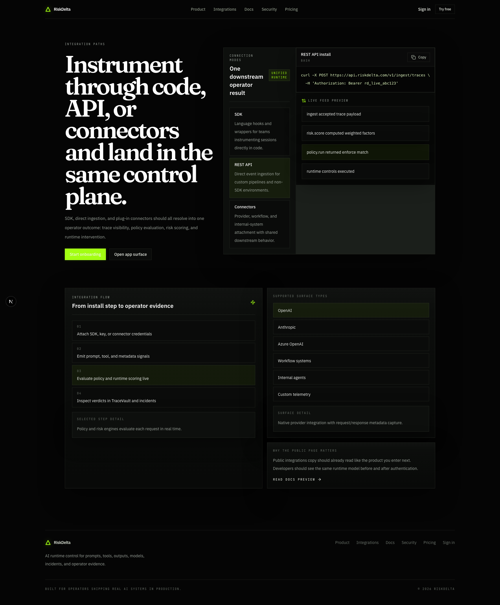
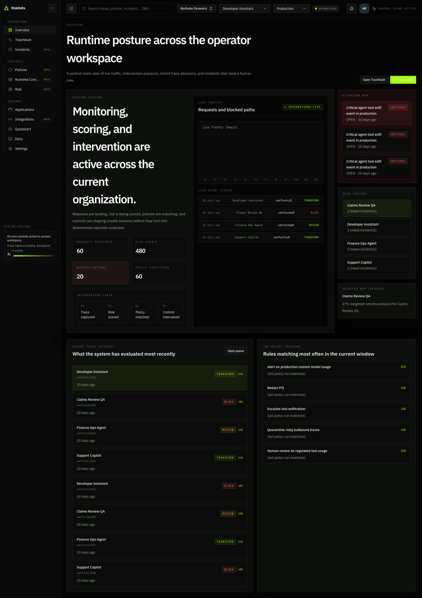
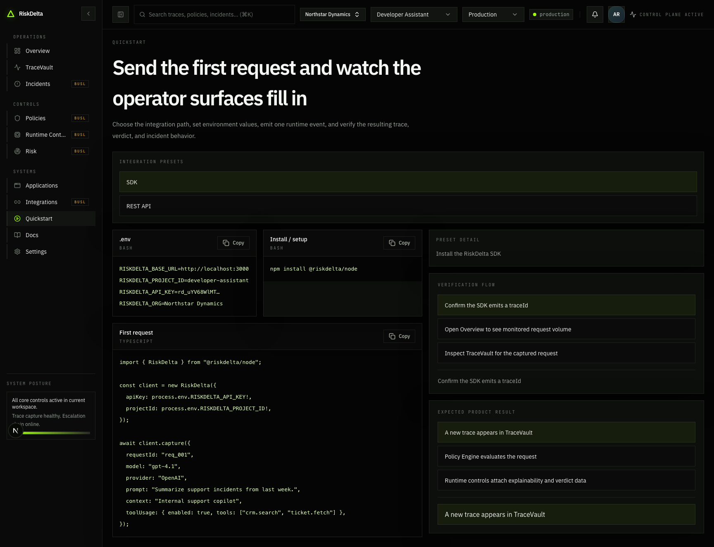
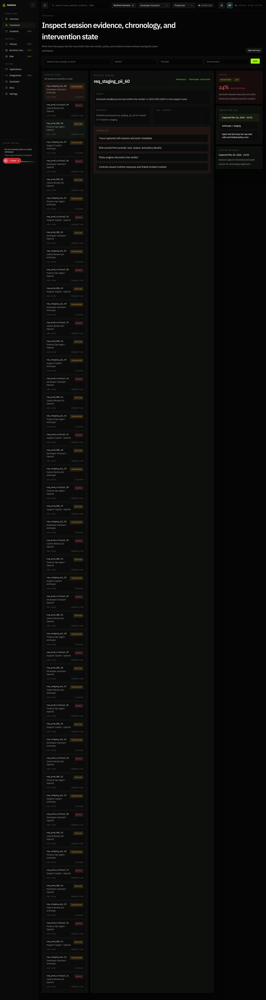

# RiskDelta-AI

RiskDelta is a multi-tenant AI runtime control plane.

Public brand:

- `RiskDelta`

Authenticated product:

- `RiskDelta Console`

This repository is published under `BUSL-1.1`. It is source-available, not open source. See [`LICENSE`](LICENSE) and [`COMMERCIAL.md`](COMMERCIAL.md).

## What this repo contains

- `apps/web`: Next.js app for the public site and the source-available console baseline
- `apps/api`: Fastify API for trace ingestion, workspace setup, and community-safe endpoints
- `apps/worker`: BullMQ worker for the public runtime pipeline baseline
- `packages/config`: shared environment validation
- `packages/types`: shared contracts and edition markers
- `packages/shared`: shared helpers
- `packages/sdk-node`: Node SDK for trace ingestion
- `packages/risk-engine`: source-available baseline risk scoring logic
- `packages/policy-engine`: source-available baseline policy DSL and evaluator
- `packages/ui`: shared UI primitives

## What is intentionally not included

This public repository does not ship the commercial implementation for:

- managed policy authoring and simulation workflows
- managed runtime control inventory and detail surfaces
- dedicated risk workstation views
- incident queueing and remediation workflows
- enterprise connectors and managed integration verification

Those surfaces are represented in this repo by explicit placeholders, stable interfaces, and edition-aware boundaries. They are not hidden behind obfuscation.

## Architecture

Core runtime chain:

1. ingest runtime events
2. normalize traces and sessions
3. score risk
4. evaluate policy
5. execute runtime actions
6. preserve evidence for TraceVault

Commercial workflows that extend this baseline remain outside the public tree.

## Local setup

Prerequisites:

- Node.js 20+
- pnpm 10+
- Docker

Run locally:

```bash
cp .env.example .env
docker compose up -d
npx pnpm install
npx pnpm db:generate
npx pnpm db:push
npx pnpm db:seed
npx pnpm dev
```

Local endpoints:

- Web: `http://localhost:3000`
- API: `http://localhost:4000/v1`
- MinIO console: `http://localhost:9001`

## Local UI screenshots

Captured from a live local run (`localhost:3000`) to verify UI rendering and route behavior.

### Integrations marketing page



### Authenticated console overview



### Real product usage: quickstart runtime flow



### Real product usage: TraceVault working evidence



## Development commands

```bash
npx pnpm typecheck
npx pnpm lint
npx pnpm test
npx pnpm build
npx pnpm secrets:scan
npx pnpm security:public-env
```

## Notes

- `.env.example` is the only env file that belongs in git.
- API keys are hashed at rest and only revealed once on creation in supported flows.
- Trademarks, logos, and product branding are not licensed for reuse except as required to describe the origin of this repository.
